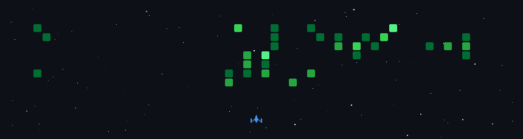

<div align="center">


</div>

<div align="center">


</div>

<br>

<div align="center">

[](https://thavaneshwaran.org)

[](https://linkedin.com/in/thavaneshwaran-s-86818a326)

[](https://github.com/thavansys)

[](mailto:dthavan628@gmail.com)


</div>

---


# 👨‍💻 whoami

```python
class Thavaneshwaran:

    role = "AI Engineer"

    location = "India"

    focus = [
        "Machine Learning",
        "Generative AI",
        "RAG Systems",
        "FastAPI"
    ]

    currently_building = [
        "RAG Applications",
        "AI Assistants",
        "FastAPI APIs",
        "Machine Learning Projects"
    ]

    learning = [
        "Deep Learning",
        "Agentic AI",
        "MLOps"
    ]

    mission = "Build useful AI systems that solve real-world problems"

    motto = "Learn. Build. Deploy. Repeat."
```


# 🚀 What I Do

<table>
<tr>
<td width="50%">

### 🤖 Artificial Intelligence

- Retrieval-Augmented Generation (RAG)
- AI Chatbots
- LLM Applications
- Prompt Engineering
- AI Assistants

### 📊 Machine Learning

- Classification Models
- Regression Models
- Feature Engineering
- Data Analytics
- Model Evaluation

</td>

<td width="50%">

### ⚡ Backend Development

- FastAPI
- Pydantic
- REST APIs
- Authentication Systems
- Database Integration

### 🔬 Currently Exploring

- Deep Learning
- Agentic AI
- Vector Databases
- MLOps
- AI Infrastructure

</td>
</tr>
</table>

---

# 🌟 Featured Projects

<table>
<tr>

<td width="50%">

## 🚀 RAGCore

Modular Retrieval-Augmented Generation framework built with FastAPI and LLMs.

</td>

<td width="50%">

## 🤖 Multilingual AI Assistant

Tamil + English conversational AI assistant.

</td>

</tr>

<tr>

<td width="50%">

## 💻 CoBrain CLI

AI-powered command-line productivity assistant.

</td>

<td width="50%">

## 📈 Disease Prediction System

Machine Learning healthcare prediction platform.

</td>

</tr>

</table>

---

# 🛠️ Tech Arsenal

<div align="center">


<br><br>


</div>

---

# 📊 GitHub Statistics

<div align="center">


</div>

---

# 🔥 Contribution Streak

<div align="center">


</div>

---

# 📈 Contribution Overview

<div align="center">


</div>

---

# 📊 Activity Graph

<div align="center">


</div>

---

# 🚀 Space Shooter

<div align="center">



</div>

---

# 📫 Connect With Me

<div align="center">

<a href="mailto:dthavan628@gmail.com">

</a>

<a href="https://linkedin.com/in/thavaneshwaran-s-86818a326">

</a>

<a href="https://github.com/thavansys">

</a>

<a href="https://thavaneshwaran.org">

</a>

</div>

---

<div align="center">

### 🚀 Building AI Systems One Project At A Time


</div>
